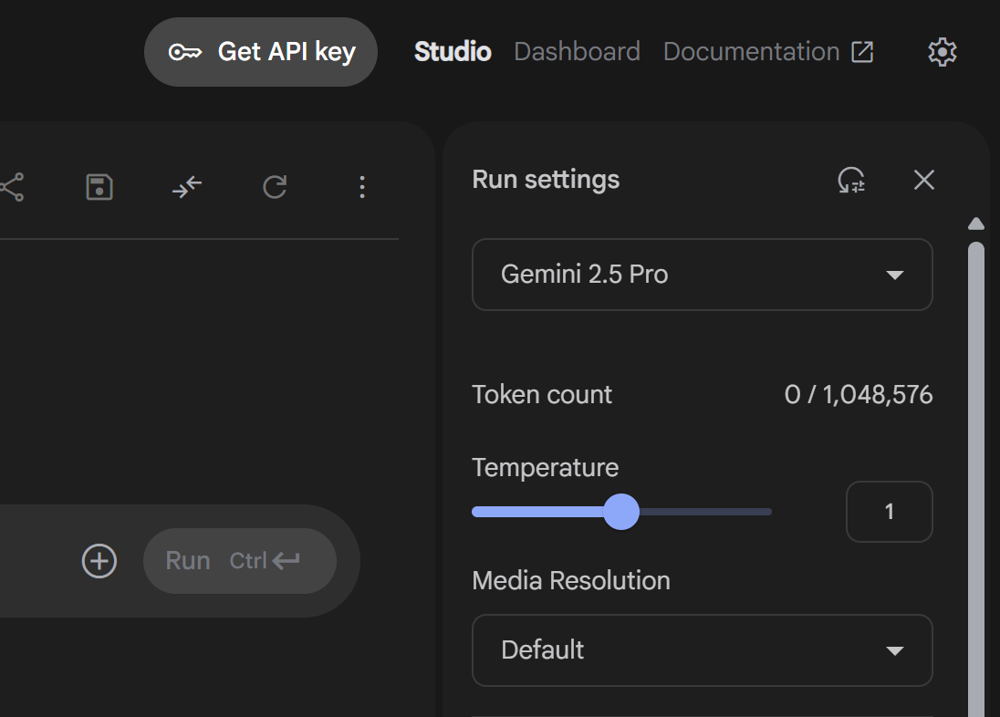
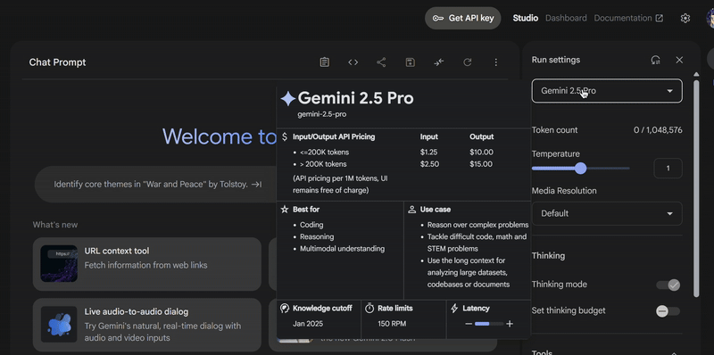

# 🤖 Gemini CLI Chatbot – Zero X Edition

[](https://choosealicense.com/licenses/mit/)

Một ứng dụng chatbot sử dụng **Gemini AI của Google**, chạy trong **giao diện dòng lệnh** với hiệu ứng như game. Bạn có thể trò chuyện, thay đổi theme, lưu lịch sử và tận hưởng hiệu ứng chữ động cực ngầu!

---

## ✨ Tính năng

- 🎮 Giao diện chọn menu bằng mũi tên `↑ ↓` (InquirerPy)
- 🎨 Đổi theme màu trong cài đặt (chưa có)
- 🧠 Kết nối trực tiếp API Gemini
- ⌨️ Hiệu ứng chữ động với `terminal-text-effects`
- 🕘 Hiển thị thời gian từng tin nhắn
- 💾 Hỗ trợ lưu/hiển thị lịch sử trò chuyện

---

## Library và version:

[](https://shields.io/)
[](https://pypi.org/project/InquirerPy/)
[](https://pypi.org/project/pyfiglet/)
[](https://pypi.org/project/colorama/)
[](https://pypi.org/project/python-dotenv/)
[](https://pypi.org/project/terminal-text-effects/)
[](https://pypi.org/project/tabulate/)
[](https://pypi.org/project/rich/)

---

## 🧰 Cài đặt

### 1. Clone dự án

```bash
git clone https://github.com/ChickenSoup269/ai_terminal_py.git
cd ai_terminal_py
```

### 2. Cài đặt thư viện

```bash
pip install -r requirements.txt
```

### 3. lưu ý nên trước khi sử dụng

1. Đầu tiên các bạn cần có API key của Gemini (bắt buộc) và tên model của nó
2. Lấy API key ở tại trang web này
   https://aistudio.google.com/prompts/new_chat

3. Chọn model của bạn ở đây và get API key là xong

<p align="center">

</p>

<p align="center">

</p>

**Đoạn code bên dưới khi chạy sẽ tự tạo**
(nếu có thay đổi API thì vào file .env thay nhé)

```bash
GEMINI_API_KEY= your_gemini_api_key_here
GEMINI_MODEL= your_model
```

### 4. Chạy ứng dụng

```bash
python3 main.py
```

## Hoặc

```bash
python main.py
```

- Tùy nhưng python3 thì nhanh hơn theo mình cảm nhận

### Screenshots

<p align="center">

</p>
<p align="center">

</p>
<p align="center">

</p>
<p align="center">

</p>
---

### Ngoài lề

- Các bạn nào thích cách mình custom terminal thì mình đã có link hướng dẫn nhé
  https://github.com/ChickenSoup269/Custom-Themes-Oh-my-posh
